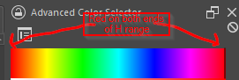

# minecraft_auto_fish
Minecraft Auto Fish

# Description:

This Python script automatically fishes for you on Minecraft.  It does this by watching the bobber and when it sees the bobber disappear, it uses pyautogui to create a mouse click.  It then automatically re-casts the bobber.

# Installation:

* install latest version of Python from https://www.python.org/downloads/

* checkout or clone this github project to a folder.
    * https://github.com/chiplukes/minecraft_auto_fish/archive/refs/heads/main.zip
    * git clone https://github.com/chiplukes/minecraft_auto_fish (if you have git installed)

* open a shell inside folder (cmd or windows terminal)

* run setup.bat
    * this creates a virtual environment in this folder and installs necessary packages (pyautogui, etc.)

* for convenience, you can edit the autofish.bat file with the correct path for where you placed py_auto_fish on your pc. Then right click and make a shortcut and copy this to your desktop.

# Usage

First, you should find or create a nice safe place to fish if you plan on being AFK :)  I like to build a walled in area, with leaves on top of the walls so that mobs do not spawn on top

In theory you need at least a 5x5x2 pool of water, but I would go bigger so that you have some flexibility when you cast.  Otherwise you have to cast the bobber into the exact center block.

Build a platform that consists of a hopper and chest to catch any loot (preferably a chain of many hoppers and chests).  Just watch any of the pre 1.16 AFK fishing designs on youtube for examples.

Once you have the place to fish you can press F11 to run Minecraft in a window.  You want some space next to this window to have the python program running with a bobber view window as well as the command prompt.  Also, it works best to have the autofish shortcut in this space on the desktop.

Cast bobber to spot you want to fish at.

Press ESC key.

Double click on autofish shortcut.

Follow instructions in command prompt.  In general you are moving the mouse pointer to where you want things and then pressing the enter key.  You need to do this with the cmd window active (don't click on mouse on any other windows)

* move mouse to upper left hand corner of imaginary rectangle around bobber, then press enter.
* move mouse to lower right hand corner of imaginary rectangle around bobber, then press enter.
* move mouse to where you want to cast (crosshair), then press enter.
* move mouse to where you want the bobber view window placed (somewhere next to Minecraft window), then press enter.

Finally, you will be given 5 seconds to click the back to game button and cast the bobber (if it is not already cast).

After the 5 seconds you should see the red part of the bobber show up in the bobber view window.  This is a live view of what the python script is seeing.  Whenever the red goes away, it performs a mouse click.

# FAQ

## Why?

Short answer:

It is fun to solve problems using Python!

Longer answer:

This was built to help out on a Minecraft world that I play on with my son.  Fishing in Minecraft is a really simple way to get XP and obtain enchantments such as mending.  Starting in 1.16 Mojang removed the ability to easily fish for treasure.  We were curious to test how much treasure can be gathered by AFK fishing.

## Is this safe to run?

This Python script uses a couple of well known packages (pyautogui, pillow, opencv-python, and mss).  The script itself is pretty simple to follow (~ 100 lines of code).  Take a look at it yourself!

However, with anything that is performing mouse clicks automatically, there is some risk that if Minecraft was to close or windows to move around that the script could click on things on the desktop.  In this case, the right mouse click that the script is doing should not be too dangerous. Also, the script will stop if it does not see the red of a bobber for many seconds after a cast.

That said, the author of this project is not responsible for any issues that may occur from use of this script.

## Will this run on my PC?

This ran easily on an older Intel Core i3-10100 based PC.  It should run on older hardware.

## How do I adjust the color filtering for bobber detection?

The HSV color space works well for filtering a specific color tha changes in brightness (day vs. night).

The only issue with HSV is that the red of the bobber exists on both ends of the Hue (range) as shown below:

Thus, two masks are required to adequately filter for red.

If you need to figure out a new mask you can take a screenshot of the bobber and then use hsv_thresh.py script to figure out the HSV thresholds.

# License

[MIT](https://choosealicense.com/licenses/mit/)
